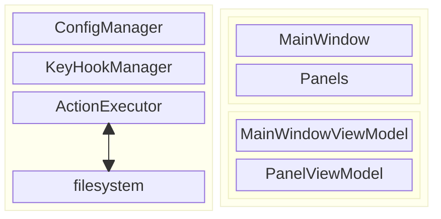

# CatCommander
a cross-platform mouse-free file manager written in Avalonia, tributing to Total Commander

# Architecture

The overall architecture is quite simple, just a typical MVVM app. There three main parts:
1. data source: read files info from file system, compressed archive, sftp and ftp, etc.
2. UI
3. keymap management

## Key Components

- ConfigManager: save and load config, including keymap, which is the most important feature of this app.
- KeyHookManager: monitoring key events at system level, and send registered key events to ActionExecutor
- ActionExecutor: do file operations on OS filesystem, update the related ViewModels
- Windows/Panels: Avalonia UI
- ViewModels: composite view model for UI, a global view model for MainWindow, and each panel has its own view model, requires more memory, but faster UI response

# TODO

- Compressed Files
  - view
  - compress
  - decompress
- File preview
  - text, markdown
  - office
  - image
  - hex
  - use system provided functions, like finder in MacOS and explorer in Windows
- open cmd/powershell/bash/zsh in current folder
- compare folders
- filter file types (ctrl+F12/11/10)
- navigation back and forth
- goto arbitrary folder (ctrl shift c)
- file operation in background thread
- tabs operation
  - create new
  - duplicate or move to the other side
- favorites and common folders
- sort in different ways (ctrl+f3/f4)
- fast filter by filename
- expand current folder or selected folders to flattened list
- SFTP
- FTP
- customized theme
