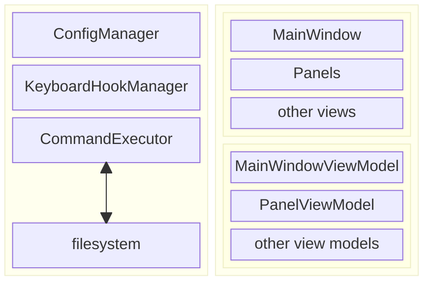

# CatCommander
a cross-platform mouse-free file manager written in Avalonia, tributing to Total Commander

# Architecture

The overall architecture is quite simple, just a typical MVVM app. There three main parts:
1. data source: read files info from file system, compressed archive, sftp and ftp, etc.
2. UI
3. keymap management

## Main Components

- ConfigManager: save and load config, including keymap, which is the most important feature of this app.
- KeyHookManager: monitoring key events at system level, and send registered key events to ActionExecutor
- ActionExecutor: do file operations on OS filesystem, update the related ViewModels
- Windows/Panels: Avalonia UI
- ViewModels: composite view model for UI, a global view model for MainWindow, and each panel has its own view model, requires more memory, but faster UI response

# keyboard events processing

## Two layers, two type systems

There are two keyboard event type systems: Avalonia and SharpHook

### Avalonia

Avalonia works at app layer, and has two enums: Avalonia.Input.KeyModifiers and Avalonia.Input.Key, which are used in Avalonia.Input.KeyEventArgs class. This is quite simple and straightforward.

### SharpHook

But Avalonia key event system can not process some shortcuts like Ctrl+F6 or Meta+F7, etc. These shortcuts are processed by MacOS, the OS has 'eaten' them and will not send them to Avalonia app. So we need SharpHook which works in a lower layer, and thus introduces more details.

- KeyPressed and KeyReleased events are triggered separately
- Alt, Control, Meta, Shift keys distinguish between left and right

Think about the key event sequence:

1. left alt down
2. right alt down
3. left alt up
4. letter 'F' down
5. right alt up
6. letter 'F' up

Practically, an 'Alt+F' event should raise on letter 'F' down, so we need to track each low level key event and raise events to app layer properly.

## Shortcuts

In config file, key shortcuts are in string format, but we use a normalized record struct internally for performance.

## Distinguish shortcuts and normal text input

UI app is complicated, because user interactions are complicated by nature.
Think about a simple case: when user pressed Ctrl+A, app need to deal with the key events in different cases. 

- UI is in 'text input mode', Ctrl+A meaning select all editing text, for example:
  - renaming files
  - creating new folders
  - input arbitrary path directly
  - input filter text in a panel
- UI is in 'shortcut mode', Ctrl+A meaning select all items in the panel

Theoretically, we can process all keyboard events in SharpHook, but it needs a lot of unnecessary work like translating low level key strokes into character input events, which is already done by Avalonia event system (see [Avalonia source code on github](https://github.com/AvaloniaUI/Avalonia/blob/master/native/Avalonia.Native/src/OSX/KeyTransform.mm)). 

# TODO

- Compressed Files
  - view
  - compress
  - decompress
- File preview
  - text, markdown
  - office
  - image
  - hex
  - use system provided functions, like finder in MacOS and explorer in Windows
- open cmd/powershell/bash/zsh in current folder
- compare folders
- filter file types (ctrl+F12/11/10)
- navigation back and forth
- goto arbitrary folder (ctrl shift c)
- file operation in background thread
- tabs operation
  - create new
  - duplicate or move to the other side
- favorites and common folders
- sort in different ways (ctrl+f3/f4)
- fast filter by filename
- expand current folder or selected folders to flattened list
- SFTP
- FTP
- customized theme
